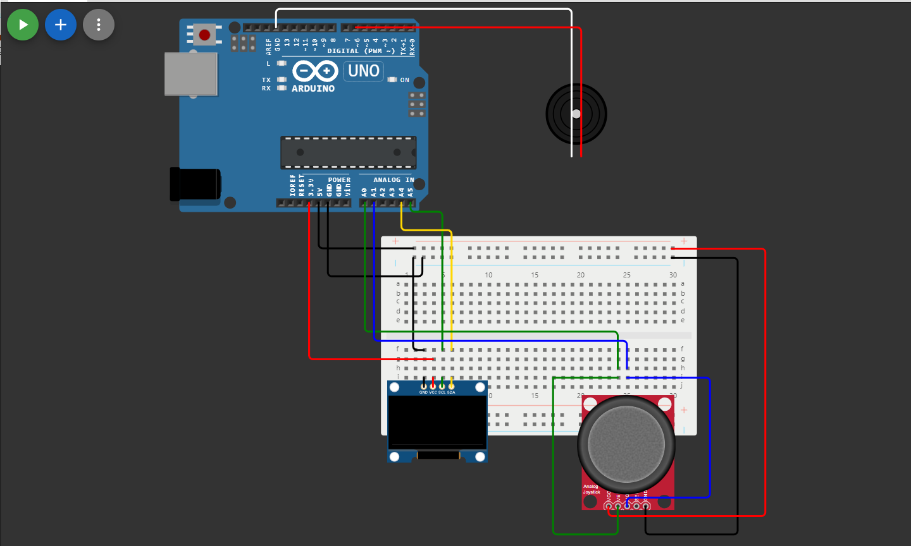

# Snake Game on Arduino with OLED Display

This project is a classic Snake game implemented on an Arduino Uno using an OLED display, joystick module, and a buzzer for sound effects.

## Features
- **OLED Display**: Renders the game graphics.
- **Joystick Control**: Moves the snake in four directions.
- **Buzzer Feedback**: Plays sounds when the snake eats food and when the game is over.
- **Scoring System**: Tracks and displays the current score and level.
- **Increasing Difficulty**: The snake's speed increases as the level progresses.

## Components Required
- **Arduino Uno**
- **0.96-inch OLED Display (SSD1306, I2C)**
- **Joystick Module (Analog)**
- **Buzzer**
- **Connecting Wires**
- **Breadboard**

## Circuit Diagram


## Wiring Connections
| Component        | Arduino Pin |
|-----------------|-------------|
| OLED VCC        | 5V          |
| OLED GND        | GND         |
| OLED SDA        | A4          |
| OLED SCL        | A5          |
| Joystick X-axis | A0          |
| Joystick Y-axis | A1          |
| Joystick GND    | GND         |
| Joystick VCC    | 5V          |
| Buzzer (+)      | D6          |
| Buzzer (-)      | GND         |

## Installation
1. Install the required libraries in the Arduino IDE:
   ```sh
   Arduino Library Manager -> Search for "Adafruit SSD1306" & "Adafruit GFX" -> Install
   ```
2. Clone this repository:
   ```sh
   git clone https://github.com/yourusername/snake-game-arduino.git
   ```
3. Open the Arduino IDE and upload `snake_game.ino` to your Arduino board.

## How to Play
- Use the **joystick** to move the snake.
- Eat the **food** to increase your score.
- Avoid hitting the **walls** or yourself.
- The game **ends** if the snake collides with the wall or its own body.

## Code Overview
- `keyScan()`: Reads the joystick input and updates the snake's direction.
- `draw_snake()`: Renders the snake on the OLED display.
- `draw_food()`: Generates random food positions.
- `snake_move()`: Moves the snake based on the current direction.
- `check_snake_die()`: Detects collisions and determines game over.
- `screen()`: Refreshes the game screen.
- `draw_game_over()`: Displays the "Game Over" screen with the final score.

## Possible Improvements
- Add more difficulty levels.
- Implement a pause function.
- Add a high-score system.

## License
This project is open-source under the MIT License.

## Author
- **Your Name**
- GitHub: [SD2911](https://github.com/SD2911)


